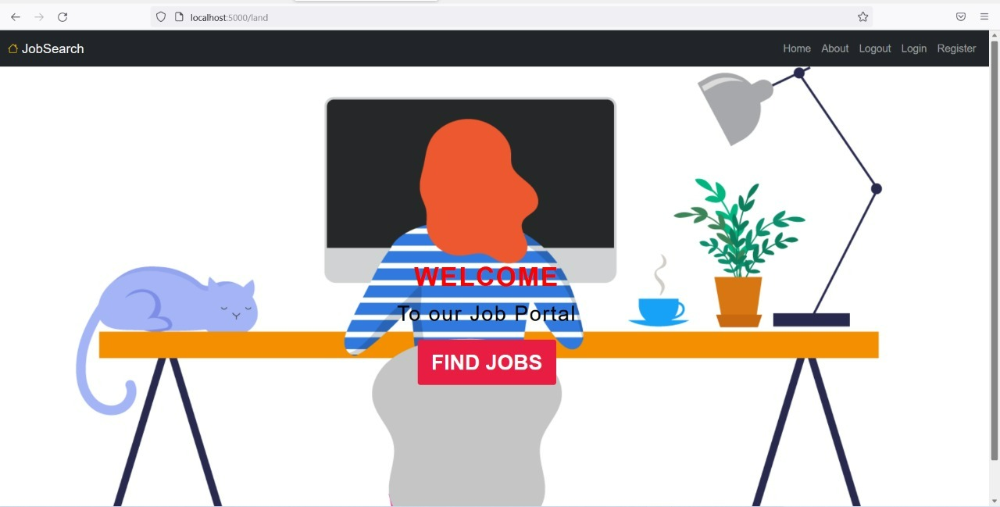
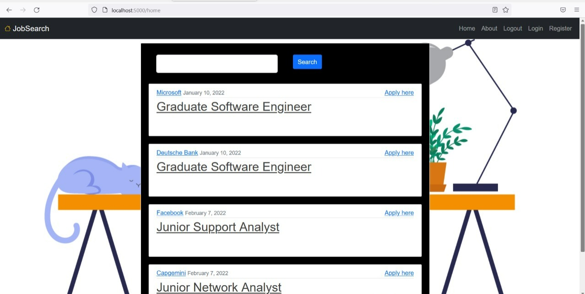
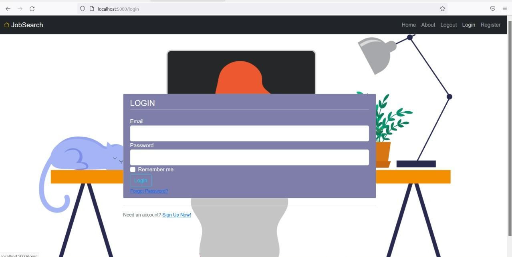
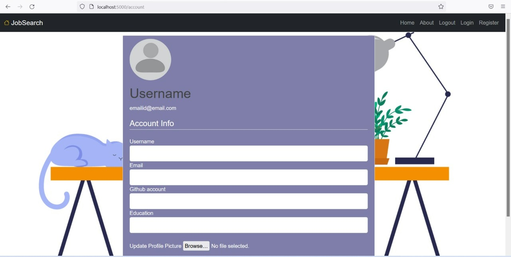
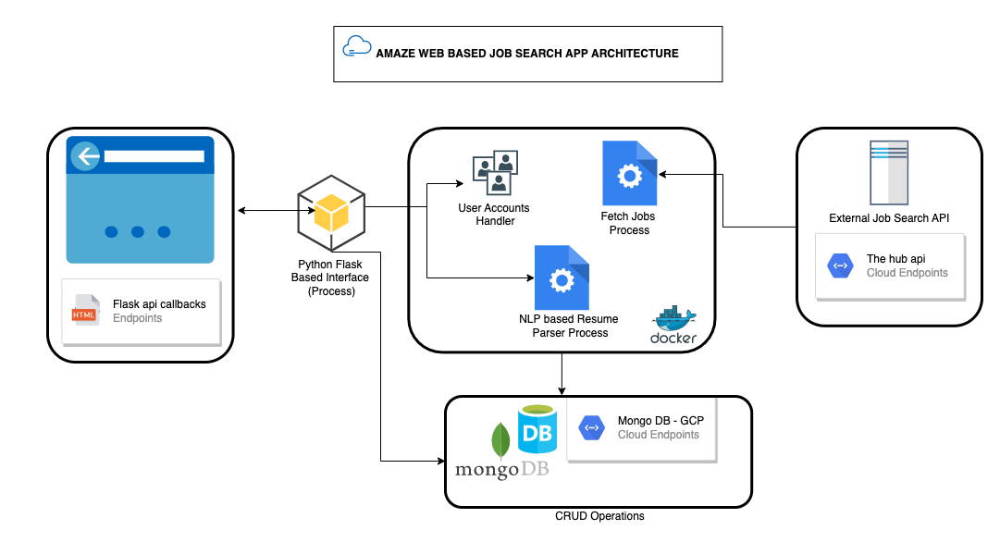

# About Amaze Job Search Web App
<table>
<td>
    This README provides a rundown of our Cloud Computing Mini Project (ECS781P) done at Queen Mary University of London. 
    We have developed a simple job search application for students. It utilises an open API sourced from the Hub, which can be found 
    [here](https://api.thehub.io/jobs/)
  
    
</td>
</table>

## The app in a nutshell:
Amaze Job Search Web App is tailored for graduating IT students. The web app uses REST based APIs for smart job search. A smart recommender system is implemented which picks up required details from resumes like skills, personal info, hobbies and in return recommends the most suitable jobs according to current job openings. A sleek web interface has been implemented to ease the laborious process of job hunting. The app also lists available positions. 

## How the app runs:
* The apps HTML pages utilises Bootstrap. 
* At the backend, the code for the apps functionality is written in Python. 
* Pythons micro framework Flask is also used.
* The application uses MongoDB database for accessing persistent information.
* Support for Cloud Scalability, deploying in a container environment.

## Demo
Here is a working live demo :  [link to youtube video]


## Site
Few snapshots of individual pages with their descriptions.

### Landing Page


### Job Display 

An overview of open job positions.

### Login Pages




## Setup and Launch
The application uses a mono-repo with multiple packages. To install and initialize all the packages on a local development environment, including running a docker image for the DB and seeding the DB, execute the following commands in the project root folder:


```jsx
make env-setup
make local # To run on local
make cloud # TO run on cloud
```

## Architecture


Why smart app? Uploaded resumes will be pushed to NLP based resume parser process which extracts out relevant keywords. These keywords will then be pushed to the database which fetches relevant jobs. 

## Mobile support
The Web App is compatible with devices of all sizes and all OSs, and consistent improvements will be made.

### Development
Want to contribute? Great!

To fix a bug or enhance an existing module, follow these steps:

- Fork the repo
- Create a new branch (`git checkout -b improve-feature`)
- Make the appropriate changes in the files
- Add changes to reflect the changes made
- Commit your changes (`git commit -am 'Improve feature'`)
- Push to the branch (`git push origin improve-feature`)
- Create a Pull Request 

### Bug / Feature Request
If you find a bug (the website couldn't handle the query and / or gave undesired results), kindly open an issue [Here](https://github.com/vishalsmak/amazeballs-job-search/issues/new) by including your search query and the expected result.

If you'd like to request a new function, feel free to do so by opening an issue [here](https://github.com/vishalsmak/amazeballs-job-search/issues). Please include sample queries and their corresponding results.


## Built with 
* [Python](https://docs.python.org/3/)
* [Flask](http://flask.pocoo.org/docs/1.0/)
* [Docker](https://docs.docker.com/)
* [MongoDB](https://www.mongodb.com/docs/) 
* [HTML](https://developer.mozilla.org/en-US/docs/Web/HTML) 
* [CSS](https://developer.mozilla.org/en-US/docs/Web/CSS) 

## To-do
- Integrate learning 


## Team

[Namrata](https://github.com/NamrataKankaria) | [Vishal](https://github.com/vishalsmak)
---|---
[Kriti](https://github.com/KritiJaggi) | [Maanav](https://github.com/maanavb)

## [License](link)

MIT © 

